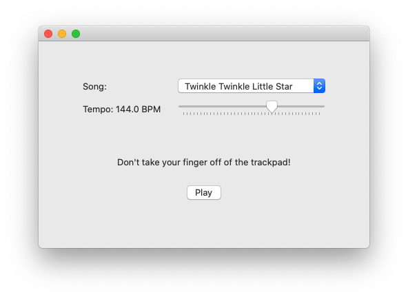
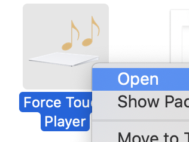
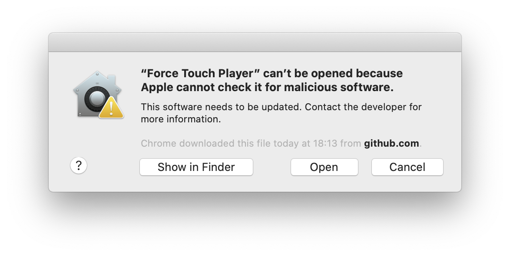
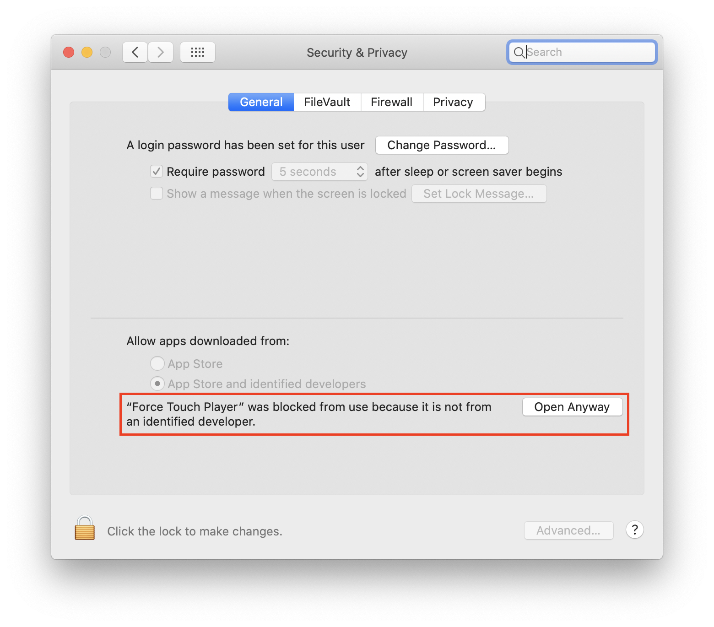

# Force Touch Player

Do you own a MacBook™?

Do you think the builtin Stereo Speakers™ are too limiting?

Have you realized your Force Touch™ Trackpad is not a huge glass button, but a huge glass **vibration motor**?

You see where I'm getting at. Introducing the Force Touch Player™ (not actually a trademark)

Play your favorite 8-bit tunes _in_ the trackpad, _with_ the trackpad, _on_ the trackpad. No speaker required!

## Wow, very music

- Download [ForceTouchPlayer.zip from latest release](https://github.com/danilofuchs/ForceTouchPlayer/releases)
- Unzip the file
- Right click the .app file and `Open`

  
  
  

- Click **Open** to confirm opening of untrusted sources (I'm sorry)
   
  
   

- You may need to [allow it in settings as well](#permissions)
- Run the app
- Select a tune from the [Jukebox](#jukebox)
- Click _Play_
- **Don't take your finger off the trackpad after clicking play!**
- Get your ears close to the trackpad (it will not bite you)
- Sing the melody mentally, it may help

_Needs macOS 10.15 (Catalina) or later_

## Jukebox

- Twinkle Twinkle Little Star™
- Tetris Theme A™
- Happy Birthday to You™
- The Imperial March™
- Hedwig's Theme™
- Cantina Band™
- DooM™ E1M1

(that's it)

## Whoa, Black magic™?

No witchery here.

Only a very, very bad usage of Creative Programming™

> In Brazil, we don't say _Programming_, we say _Gambiarra_ and I think it's beautiful

It turns out since the 2015 MacBook™ Pro™ with Retina Display™, the trackpad is **not** a button. It is instead a vibration motor (vibracall), not very different from your Nokia 3310™.

Apple's engineers figured that managing the clicky feel via software would lead to a much better experience and fewer defects instead of the old, outdated™, mechanical switch.

So they did.

They also figured developers would find it appealing for their apps to interact with users with awesome Haptic Feedback™. Clicky things everywhere!

So they did.

They thought people would only use it for good, for the almighty UX™

So they did.

Do you realize what they created? Not only they made a noisy motor, but they also created a way to control it precisely (`NSHapticFeedbackPerformer`™)

You know what this means? They created a _speaker_

Well, not really, but we can make it sound like one

## Permissions

I don't have an Apple certificate to publish this app the right way. For you to use the app, you must allow this app to be ran:

### Allow in Finder™

- Right click (or control+click) the App:

 

- Click **Open**

 

### Allow in Settings™

- Try to run the app once

- Go to Settings > Security & Privacy

- Click **Open Anyway**

 

## Contributing

Are you sure?

This can't be right. Really?

### Your toolkit

You will need Xcode™ 11+ running on macOS™ 10.15 (Catalina) or later. This project uses SwiftUI with features introduced in 10.15.

Open the project on Xcode and run it using Debug scheme.

There may be some issues related to certificates. Make sure you have your development certificate configured correctly on Xcode.

To create a release build, run **Product** > **Archive**.

### Is there even a limit?

Who knew trackpads had limits? I could only get it to work until around 220Hz (A3). If you are brave enough, maybe you can find a way to make it less bad™

### Adding a new tune

Any flute melody can work, as they only output a single note at a time. I recommend using parts from https://www.flutetunes.com/

Remember to only use the lower keys (B0 -> B2)

Songs can be adapted from [`arduino-songs`](https://github.com/robsoncouto/arduino-songs). They are already curated and it is pretty much a task of copying and translating C arrays to Swift™

### MIDI support?

That would be nice

### iPhone™?

🤔
